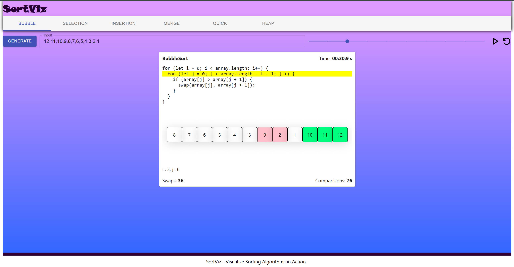

# SortViz - Sorting Algorithm Visualizer

Welcome to **SortViz**, a powerful and interactive sorting algorithm visualizer designed to help you understand the inner workings of sorting algorithms in a fun and engaging way. Whether you're a student, educator, or simply curious about sorting algorithms, SortViz lets you watch sorting algorithms in action while tracking key metrics like swaps, comparisons, and execution time.

### 🚀 Key Features
- **Visualize Sorting Algorithms**: Watch different sorting algorithms sort an array of 3-digit positive integers step by step.
- **Track Performance**: Keep track of swaps and comparisons made during the sorting process.
- **Compare Algorithms Side by Side**: Visualize multiple algorithms sorting the same array simultaneously for a direct comparison of their efficiency.
- **Adjust Speed**: Control the execution speed for better understanding and deeper insights.
- **Interactive Controls**: Start, pause, and reset the sorting process at any point.
- **Generate Random Arrays**: Automatically generate random arrays of numbers for testing different scenarios.

### ⚡ Features at a Glance:
- Sort any given array of 3-digit positive integers
- Control the speed of execution
- Start, pause, or reset execution at any time
- Generate new random arrays with each execution
- Compare multiple sorting algorithms side by side for performance analysis

### sample screenshot 

### 🚀 Get Started Locally
To run **SortViz** on your local machine, follow these steps:

   bash
   git clone https://github.com/Crypt0-X2/SortViz
   npm install
   npm run dev

Access the App: Once the server starts, open your browser and visit http://localhost:3000 to start using SortViz.
